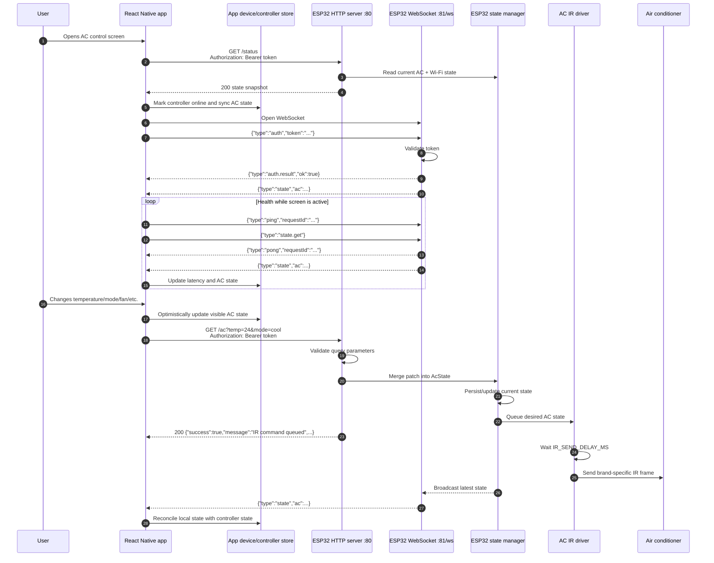

# ESP32 IR Control

This document describes how the mobile app communicates with the ESP32 when the user controls an air conditioner, and how the ESP32 turns that request into an infrared command.

## High-level flow

After a controller is paired, the app stores the ESP32 host and token with the controller record. When the user opens an AC screen, the app:

1. Fetches the latest state from `GET /status`.
2. Opens `ws://<esp32-ip>:81/ws`.
3. Authenticates the WebSocket with the controller token.
4. Keeps a ping/state loop running while the screen is active.
5. Sends AC commands over REST `GET /ac?...`.
6. Applies incoming state snapshots to the local device store.

The firmware receives each AC command as a partial desired state, validates it, merges it with the current AC state, queues the state for IR transmission, and responds immediately with JSON. The main firmware loop sends the queued IR frame after `IR_SEND_DELAY_MS`.

## Sequence diagram



## REST command path

The app's primary AC command client is `src/api/acCommandApi.ts`. It sends a `GET` request to:

```text
http://<esp32-ip>/ac?<params>
Authorization: Bearer <controller-token>
```

Accepted `/ac` parameters:

| Parameter | Values | Meaning |
| --- | --- | --- |
| `power` | `on`, `off` | Turn the AC state on or off. |
| `temp` | `16` through `30` | Set the target temperature. |
| `mode` | `auto`, `cool`, `dry`, `fan`, `heat` | Set the AC operating mode. |
| `fan` | `auto`, `1`, `2`, `3`, `4`, `5` | Set fan speed. |
| `swingVertical` | `auto`, `1`, `2`, `3`, `4`, `5` | Set vertical vane/airflow. |
| `swingHorizontal` | `auto`, `1`, `2`, `3`, `4`, `5` | Set horizontal vane/airflow. |
| `quiet` | `on`, `off` | Toggle quiet mode. Turning quiet on disables powerful mode. |
| `powerful` | `on`, `off` | Toggle powerful mode. Turning powerful on disables quiet mode. |

Example:

```http
GET /ac?power=on&temp=24&mode=cool&fan=auto&swingVertical=auto HTTP/1.1
Host: 192.168.1.50
Authorization: Bearer <controller-token>
```

Successful response:

```json
{
  "success": true,
  "power": "on",
  "temperature": 24,
  "mode": "cool",
  "fan": "auto",
  "swingVertical": "auto",
  "swingHorizontal": "auto",
  "quiet": false,
  "powerful": false,
  "message": "IR command queued"
}
```

## WebSocket state path

The WebSocket server runs at:

```text
ws://<esp32-ip>:81/ws
```

The app sends an auth message immediately after the socket opens:

```json
{ "type": "auth", "token": "<controller-token>" }
```

After authentication, the ESP32 sends:

```json
{ "type": "auth.result", "ok": true }
```

Then it can send state snapshots:

```json
{
  "type": "state",
  "ac": {
    "power": true,
    "temperature": 24,
    "mode": "cool",
    "fan": "auto",
    "swingVertical": "auto",
    "swingHorizontal": "auto",
    "quiet": false,
    "powerful": false
  },
  "connection": {
    "wifi": true
  }
}
```

The app also sends `ping` and `state.get` messages every few seconds to keep latency and state fresh.

## Firmware internals

The main firmware loop in `esp32/core/core.ino` repeatedly calls:

- `handleHttpClient()`
- `handleWebSocketServer()`
- `handlePairingButton()`
- `processQueuedIR()`
- `handleScheduleExecution()`
- `tvManager.handle()`

For AC control, the important path is:

1. `HttpServer.cpp` receives `/ac`.
2. It parses and validates query parameters.
3. It creates `nextState` by copying the current `acState` and applying requested changes.
4. `applyACStateAndRespond()` calls `applyACState(nextState)`.
5. The state manager updates the controller state and queues an IR send.
6. `processQueuedIR()` waits for `IR_SEND_DELAY_MS`.
7. `acController().send(state)` dispatches the state to the active brand driver.
8. The brand driver uses `IRremoteESP8266` to transmit the correct AC IR frame on `IR_PIN`.

## Supported AC driver model

The firmware has a generic `AcController` abstraction in `esp32/core/src/ac/AcController.cpp`. It chooses a brand driver from the persisted or default AC configuration.

Driver implementations currently exist for:

- Panasonic
- Daikin
- Mitsubishi Electric
- Mitsubishi Heavy
- Hitachi
- Gree
- Midea
- Samsung
- LG
- Toshiba

The default on-device AC profile is Panasonic DKE. The IR output pin is configured by `IR_PIN` in `esp32/core/Config.h`.

## Scheduling

Schedules use the same state shape as manual AC control. The app writes schedules to:

```text
PUT /ac/schedule
```

The ESP32 stores the schedules and `ScheduleManager` applies them locally at the configured wall-clock time. When a schedule fires, it updates `AcState` and sends IR just like a manual `/ac` request.

## Current implementation notes

- Temperature changes in the app are debounced before calling `/ac`, which avoids sending an HTTP request for every small slider movement.
- REST requests include `Authorization: Bearer <token>`.
- WebSocket auth is enforced before state or command messages are accepted.
- The firmware currently exposes WebSocket command handling, but the React Native AC screen sends manual commands through REST today.
- Token enforcement should be applied consistently to all private REST endpoints before deploying beyond a trusted local network.
