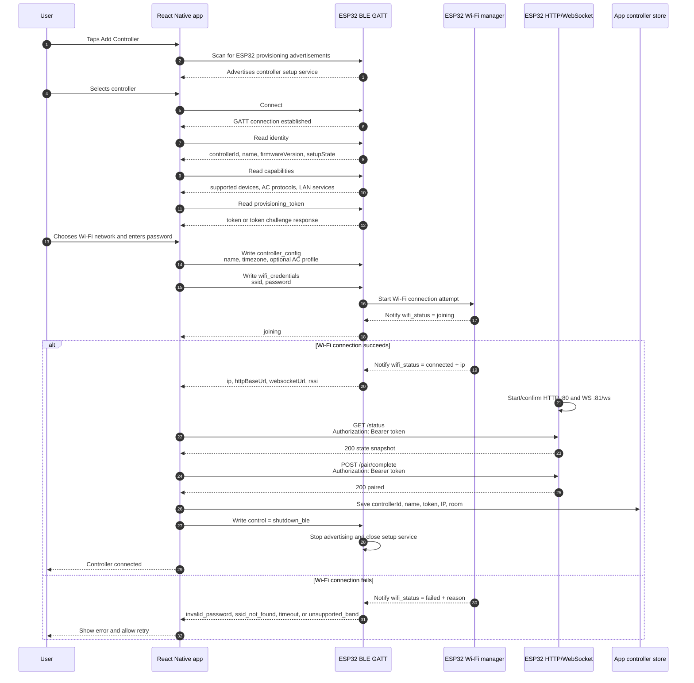

# ESP32 Connection

This document describes the intended BLE-based connection and provisioning flow between the app and ESP32 controller.

The checked-in app currently lets the user add a controller manually by entering the ESP32 IP address and token after the ESP32 has already joined Wi-Fi. The BLE flow below is the target user experience: the ESP32 advertises over BLE for setup, the app exchanges identity/security information with it, the app sends Wi-Fi credentials, and the ESP32 reports its LAN address once it connects.

## Goals

- Let a user provision a new ESP32 without typing an IP address.
- Keep long-lived control traffic on the local LAN instead of BLE.
- Use BLE only for setup, recovery, or explicit reconnect tasks.
- Give the app enough information to save a controller record: controller ID, token, IP address, name, and capabilities.
- Shut BLE down after provisioning to reduce power use and unnecessary attack surface.

## Connection states

| State | ESP32 behavior | App behavior |
| --- | --- | --- |
| `unprovisioned` | BLE advertising is enabled. Wi-Fi may be disconnected. | Scan for setup-capable ESP32 controllers. |
| `ble_connected` | BLE GATT connection is active. | Read identity/capabilities and start provisioning. |
| `wifi_joining` | ESP32 attempts to join the provided 2.4 GHz Wi-Fi network. | Show provisioning progress and wait for status notifications. |
| `lan_ready` | ESP32 has an IP address and starts HTTP/WebSocket services. | Save controller record and validate `/status`. |
| `paired` | Normal LAN control is active. BLE is shut down. | Use REST/WebSocket for control and state sync. |
| `ble_recovery` | BLE is re-enabled by button hold, app request, or failed Wi-Fi recovery. | Reconnect over BLE to update Wi-Fi or reset pairing. |

## BLE GATT contract

Use one primary provisioning service. UUIDs can be finalized when the firmware BLE module is added; the names below define the logical contract.

| Characteristic | Direction | Purpose |
| --- | --- | --- |
| `identity` | ESP32 -> app, read | Controller ID, firmware version, device name, setup state, BLE protocol version. |
| `capabilities` | ESP32 -> app, read | Supported device types, AC brands/protocols, schedule support, WebSocket support. |
| `provisioning_token` | ESP32 -> app, read or notify | One-time or device pairing token used by the app for LAN auth. |
| `wifi_credentials` | App -> ESP32, write | SSID and password for the user's 2.4 GHz Wi-Fi network. |
| `wifi_status` | ESP32 -> app, notify/read | Wi-Fi join state, error code, RSSI, and IP address when connected. |
| `controller_config` | App -> ESP32, write | Friendly controller name, room hint, timezone, and optional AC profile. |
| `control` | App -> ESP32, write | Commands such as cancel provisioning, forget Wi-Fi, reset pairing, or enable BLE recovery. |

Recommended payload format: UTF-8 JSON. Keep payloads small enough for BLE MTU limits or split larger writes into chunks with sequence numbers.

Example `identity` payload:

```json
{
  "controllerId": "esp32-a1b2c3d4",
  "name": "ESP32 Room Controller",
  "firmwareVersion": "1.0.0",
  "setupState": "unprovisioned",
  "protocolVersion": 1
}
```

Example `wifi_credentials` payload:

```json
{
  "ssid": "Home WiFi",
  "password": "example-secure-password"
}
```

Example `wifi_status` payload after successful LAN connection:

```json
{
  "state": "connected",
  "ip": "192.168.1.50",
  "rssi": -51,
  "httpBaseUrl": "http://192.168.1.50",
  "websocketUrl": "ws://192.168.1.50:81/ws"
}
```

## Provisioning sequence



## Normal control after BLE setup

BLE is not used for everyday AC control. Once provisioning succeeds:

1. The app stores `controllerId`, `httpBaseUrl`, token, room assignment, and friendly name.
2. The app polls `GET /status` to refresh controller/device state.
3. The app opens `ws://<ip>:81/ws` and authenticates with the token.
4. The app sends AC commands to `GET /ac?...`.
5. The ESP32 sends IR and broadcasts state over WebSocket.

This keeps high-frequency state sync and command traffic on Wi-Fi, where latency and throughput are much better than BLE.

## BLE shutdown and re-enable rules

After successful provisioning, BLE should be temporarily shut down until it is needed again.

Recommended triggers to enable BLE again:

- User holds the ESP32 BOOT/setup button for the configured pairing duration.
- ESP32 cannot connect to the saved Wi-Fi after several retries.
- App sends an authenticated LAN command requesting BLE recovery mode.
- Firmware detects that pairing has been reset.
- User performs a factory reset.

Recommended triggers to shut BLE down:

- App confirms LAN status through `/status` and pairing through `/pair/complete`.
- BLE provisioning times out with no connected app.
- User cancels setup.
- ESP32 finishes a recovery update and reconnects to LAN.

## Security model

Minimum recommended behavior:

- Generate a unique token per controller during first setup instead of using a shared static token.
- Never advertise Wi-Fi credentials back over BLE.
- Require an authenticated BLE session or physical setup mode before accepting Wi-Fi credential writes.
- Use short-lived setup mode windows.
- Enforce `Authorization: Bearer <token>` on all private LAN endpoints.
- Store Wi-Fi credentials and tokens in ESP32 non-volatile storage.
- Clear tokens and Wi-Fi credentials on factory reset.

For stronger security, use a BLE challenge-response exchange before sending Wi-Fi credentials and rotate the LAN token after pairing completes.

## Firmware changes needed for BLE provisioning

The current firmware already has the LAN pieces, but BLE provisioning needs these additions:

- A BLE provisioning module that advertises while unprovisioned or in recovery mode.
- GATT characteristics for identity, capabilities, token exchange, Wi-Fi credentials, Wi-Fi status notifications, config, and control commands.
- Runtime Wi-Fi credential storage instead of only compile-time `WIFI_SSID` and `WIFI_PASSWORD`.
- A unique generated pairing token instead of a static `PAIRING_TOKEN`.
- A BLE lifecycle manager that stops BLE after LAN pairing completes and restarts it for setup/recovery.
- REST auth enforcement for all private endpoints.

## App changes needed for BLE provisioning

The app needs a BLE provisioning flow before the existing controller save step:

- Scan for ESP32 controllers advertising the provisioning service.
- Connect to the selected BLE device.
- Read identity, capabilities, and token/challenge characteristics.
- Collect Wi-Fi SSID/password from the user.
- Write controller config and Wi-Fi credentials to the ESP32.
- Subscribe to Wi-Fi status notifications.
- Save the controller once the ESP32 reports its IP and `/status` succeeds.
- Request BLE shutdown after LAN pairing succeeds.

After that, the existing LAN status, WebSocket, and AC command code can continue to handle normal operation.
